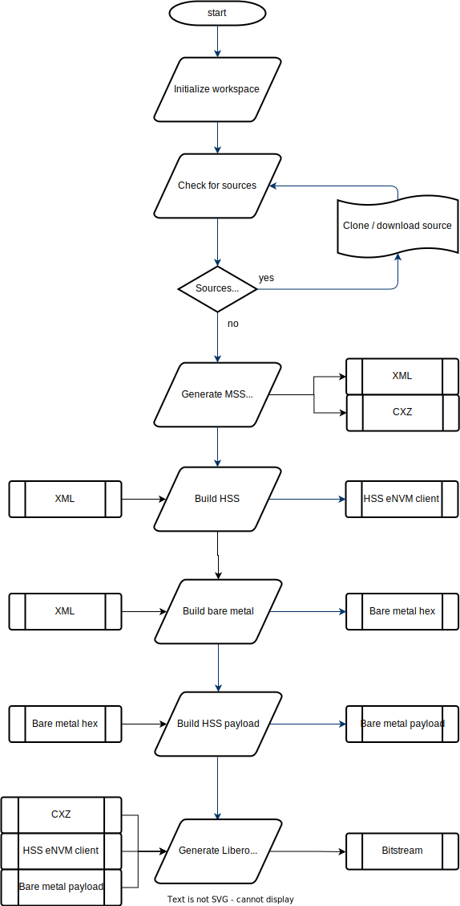
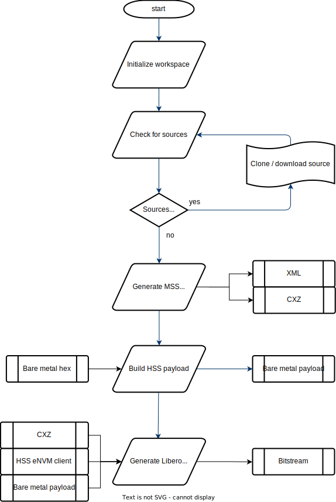

# Icicle Kit Bring Up Design Bitstream Builder Readme

## Introduction

Using the Icicle Kit Bring Up Design Bitstream Builder, bitsreams can be generated on demand in a fully version controlled environment and reproduced at a later date based on specific tags of the overall script or individual components of the bitstream. The aim of this demo is to provide a example framework which can be used to version control a Libero design.

This example targets the PolarFire SoC Icicle Kit. It creates a bring up design with minimal components and a lightweight configuration to verify device functionality on power up.

The demo itself will clone several source repositories, build a bare metal application and the Hart Software Services, generate a Libero design and import the applications into the project, finally it will generate a bitstream. This bitstream consists of an FPGA fabric and eNVM component and a system controller SPI flash client.

### Bitstream components

A bitstream can consist of multiple components targeting different aspects of an  FPGA / SoC FPGA, for example an FPGA fabric component, sNVM, eNVM, uPROM, System Controller SPI Flash etc.

Each component of a bitstream can contain multiple clients, for example, the eNVM could house a bare metal application as one client and have another client simply containing user data.

### Goal

The aim of this example is to demonstrate how a user can fetch multiple version controlled sources from different repositories, build the sources if required, create a Libero project to contain the built sources and generate a bitstream. This allows version control of a Libero project by version controlling the script that generates the clients and project from their own version control system.

### Project structure

This demo consists of several components:

1. bitstream-builder.py:
   - This is the main script used to control the generation of clients and the Libero project. It sets up the workspace and calls all tools required
2. sources.yaml:
   - This YAML file is used to list off all of the sources used in the bitstream, if they are actual source files in a VCS (e.g a git repository) or if they are artifacts stored on a URL (e.g a GitHub asset). In this example Git sources can be pulled based on a branch in a repository and also a specific commit on a branch if required.
3. Recipes:
   - Contains any additional files required to run a stage of the project creation, for example Tcl scripts to drive Libero and call design creation scripts and config files for HSS payloads.

## Required tools

This demo uses a Python script as the main driver for tools and source management.

- [Python 3](https://www.python.org/downloads/) is required on the host system

The following additional Python packages are also required

- gitpython
- requests
- pyyaml

They can be installed with the following command:

`python3 -m pip install gitpython requests pyyaml`

Note: gitpython requires git to be installed on the host system. Git can be downloaded [here](https://git-scm.com/downloads).

### Linux specific tools

On Linux the following tools are needed:

- [Libero SoC v2021.3](https://www.microchip.com/en-us/products/fpgas-and-plds/fpga-and-soc-design-tools/fpga/libero-software-later-versions#Documents%20and%20Downloads)
- [SoftConsole v2021.3](https://www.microchip.com/en-us/products/fpgas-and-plds/fpga-and-soc-design-tools/programming-and-debug/softconsole)

Note: Libero SoC also requires a license to run - this demo is supported by the free silver license.

### Windows specific tools

On Windows the following tools are needed:

- [Libero SoC v2021.3](https://www.microchip.com/en-us/products/fpgas-and-plds/fpga-and-soc-design-tools/fpga/libero-software-later-versions#Documents%20and%20Downloads)
- The PolarFire SoC MSS configurator

Note: Libero SoC also requires a license to run - this demo is supported by the free silver license.

Note: the PolarFire SoC MSS configurator is also installed with Libero SoC.

## Running the bitstream builder script

The bitstream builder supports both Windows and Linux hosts, there are more tool features available on Linux hosts so additional steps can be carried out on Linux hosts. Due to different flows there are different tools and paths needed for Windows vs Linux and there are different script arguments available.

### Running the bitstream builder script on Linux

#### Arguments available on Linux

Arguments can be used to overwrite tool paths used and also configure the flow that is used.

Multiple tools are used in this flow but these are all contained in either the Libero SoC installation or the SoftConsole installation. If one of the arguments shown below is passed all of the tools contained in that installation will be configured automatically by this script (e.g passing the Libero installation also sets the MSS configurator installation path as this is installed with Libero).

If no arguments are passed and the tools aren't found in the system path the script will attempt to use the default installation directory for a tool. If a tool isn't present the script will terminate itself before running any tools.

The following arguments are available:

- -LIB_SOC_DIR or --libero_soc_install_directory: This is the path to the installation of Libero on your system, typically /usr/local/microsemi/Libero_SoC_v2021.3/

- -SC_DIR or --softconsole_install_directory: This is the path to the installation of SoftConsole on your system, typically /home/[USERNAME]/Microchip/SoftConsole-v2021.3-7.0.0.599/

- -LM_LIC or --lm_license_file: This is where Libero should look for a license on your system

- -P or --program: passing this argument and "True" will add an additional stage at the end of script execution where a connected device will be programmed. This assumes that only one device is connected.

- -U or --design_update: passing this argument and "True" will only get the script to clone the sources and generate a Libero project, clients will not be generated or imported and the Libero flow will not be run. This argument is intended to be used if someone wanted to update the Libero design without running the full flow.

- -C or --clean: passing this argument and "True" will delete the source and output folders and return the bitstream builder repository to an initial clean state.

#### Running the script on Linux

##### Standard run with no programming on Linux

An example call is shown below to run the script and generate a bitstream:

`python3 bitstream-builder.py -LM_LIC 1702@localhost -LIB_SOC_DIR /usr/local/microsemi/Libero_SoC_v2021.3/ -SC_DIR /home/hugh/Microchip/SoftConsole-v2021.3-7.0.0.599/`

If all of the required tools are set up and available in the system path the following call could be used:

`python3 bitstream-builder.py`

##### Standard run with programming on Linux

An example call is shown below to run the script, generate a bitstream and program a connected target:

`python3 bitstream-builder.py -LM_LIC 1702@localhost -LIB_SOC_DIR /usr/local/microsemi/Libero_SoC_v2021.3/ -SC_DIR /home/hugh/Microchip/SoftConsole-v2021.3-7.0.0.599/ -P True`

If all of the required tools are set up and available in the system path the following call could be used:

`python3 bitstream-builder.py -P true`

##### Design update run on Linux

An example call is shown below to run the script in design update mode where no clients or bitstream are generated, just a Libero design:

`python3 bitstream-builder.py -LM_LIC 1702@localhost -LIB_SOC_DIR /usr/local/microsemi/Libero_SoC_v2021.3/ -SC_DIR /home/hugh/Microchip/SoftConsole-v2021.3-7.0.0.599/ -U True`

If all of the required tools are set up and available in the system path the following call could be used:

`python3 bitstream-builder.py -U true`

### Running the bitstream builder script on Windows

#### Arguments available on Windows

Arguments can be used to overwrite tool paths used and also configure the flow that is used to generate a bitstream. Libero and the MSS configurator are required to run this flow and both tool locations can be passed as arguments. If no arguments are passed and the tools aren't found in the system path the script will attempt to use the default installation directory for a tool. If a tool isn't present the script will terminate itself before running any tools.

The following arguments are available:

- -libero or --libero_soc_executable: This is the path to the installation of Libero on your system, typically C:\\Microsemi\\Libero_SoC_v2021.3\\Designer\\bin\\libero.exe

- -pfsoc_mss or --polarfire_soc_mss_configurator_executable: This is the path to the installation of the PolarFire SoC MSS configurator on your system, typically C:\\Microsemi\\Libero_SoC_v2021.3\\Designer\\bin64\\pfsoc_mss.exe

- -P or --program: passing this argument and "True" will add an additional stage at the end of script execution where a connected device will be programmed. This assumes that only one device is connected.

- -U or --design_update: passing this argument and "True" will only get the script to clone the sources and generate a Libero project, clients will not be generated or imported and the Libero flow will not be run. This argument is intended to be used if someone wanted to update the Libero design without running the full flow.

- -C or --clean: passing this argument and "True" will delete the source and output folders and return the bitstream builder repository to an initial clean state.

#### Running the scripts on Windows

##### Standard run with no programming on Windows

An example call is shown below to run the script and generate a bitstream:

`python3 bitstream-builder.py -pfsoc_mss C:\\Microsemi\\Libero_SoC_v2021.3\\Designer\\bin64\\pfsoc_mss.exe -libero C:\\Microsemi\\Libero_SoC_v2021.3\\Designer\\bin\\libero.exe`

If all of the required tools are set up and available in the system path the following call could be used:

`python3 bitstream-builder.py`

##### Standard run with programming on Windows

An example call is shown below to run the script, generate a bitstream and program a connected target:

`python3 bitstream-builder.py -pfsoc_mss C:\\Microsemi\\Libero_SoC_v2021.3\\Designer\\bin64\\pfsoc_mss.exe -libero C:\\Microsemi\\Libero_SoC_v2021.3\\Designer\\bin\\libero.exe -P True`

If all of the required tools are set up and available in the system path the following call could be used:

`python3 bitstream-builder.py -P true`

##### Design update run on Windows

An example call is shown below to run the script in design update mode where no clients or bitstream are generated, just a Libero design:

`python3 bitstream-builder.py -pfsoc_mss C:\\Microsemi\\Libero_SoC_v2021.3\\Designer\\bin64\\pfsoc_mss.exe -libero C:\\Microsemi\\Libero_SoC_v2021.3\\Designer\\bin\\libero.exe -U True`

If all of the required tools are set up and available in the system path the following call could be used:

`python3 bitstream-builder.py -U true`

## Linux tool flow

The following flow is used to produce a Libero bitstream with multiple components:

Builds of bare metal projects and the HSS are performed using SoftConsole in headless mode. This allows for a full build using the provided SoftConsole configurations in a project. This also allows access to built in tools like the boot mode programmer which can be used to generate Libero compatible hex files.

Payloads are generated using a copy of the HSS payload generator which is downloaded as an asset from the HSS releases. Libero can be called in batch mode to execute a Tcl script without displaying a GUI which is done here.

The flow used in the bitstream-builder python script is:

1. Clone sources based on the sources.yaml file
2. Generate an MSS component based on the MSS configuration cloned from the HDL repository (listed in sources.yaml)
3. Add the XML generated in step 2 and a configuration file to the HSS project that was cloned
4. Use SoftConsole headlessly to open the HSS project and build it using the "Default" configuration
5. Add the XML generated in step 2 to the mmuart example project cloned with the bare metal library from sources.yaml
6. Build the mmuart example project using the DDR Release configuration
7. Generate a HSS payload using the hex file produced in step 6 by passing a config file provided in the recipes folder of this repository to the HSS payload generator which is listed in sources.yaml
8. Generate a Libero project using the Tcl scripts included in this repository and the Libero design contained in the HDL repository which is listed in sources.yaml
9. Export final files from Libero
10. Program a target if required

## Windows tool flow

The following flow is used to produce a Libero bitstream with multiple components:

Unlike Linux, SoftConsole is not available headlessly on Windows. This means that bare metal projects can't be built directly. It would be possible to use the Linux version of SoftConsole in a Cygwin shell or WSL but for this demo it is assumed that this is not configured. Therefore bare metal projects are downloaded as prebuilt artifacts in this flow.

Payloads are generated using a copy of the HSS payload generator which is downloaded as an asset from the HSS releases. Libero can be called in batch mode to execute a Tcl script without displaying a GUI which is done here.

The flow used in the bitstream-builder python script is:

1. Clone sources based on the sources.yaml file
2. Generate an MSS component based on the MSS configuration cloned from the HDL repository (listed in sources.yaml)
3. Generate a HSS payload using the mmuart-interrupt hex file downloaded in step 1 by passing a config file provided in the recipes folder of this repository to the HSS payload generator which is listed in sources.yaml
4. Generate a Libero project using the Tcl scripts included in this repository and the Libero design contained in the HDL repository which is listed in sources.yaml
5. Export final files from Libero
6. Program a target if required

## Sources

All sources used in a run are cloned or downloaded into the sources directory - this directory will be created on the first run.

### Source types

This demo uses git as the primary version control system. Artifacts or tools can also be downloaded from an archive without needing to be built.

Sources are defined in the "sources.yaml" file. There is a defined structure for adding a source:

Source format:

    [Useful name for this source]:
        type: [git or zip]
         link: [url of git repo or archive]
         branch: [name] # if using git as a type
         commit: [hash] # if using git, you can checkout a specific commit on a branch

For example the bare metal source is added below:

    bare-metal-examples:
        type: git
        link: https://github.com/polarfire-soc/polarfire-soc-bare-metal-examples.git
        branch: main
        commit: acdddf3

For example the HSS payload generator is added as an archive below:

    HSS-payload-generator:
        type: zip
        link: https://github.com/polarfire-soc/hart-software-services/releases/latest/download/hss-payload-generator.zip

### Getting sources and getting updates from sources

On an initial run of the script with no sources present all git sources will be cloned and the required branch / commit checked out. All archives will be downloaded and extracted.

If, for example, an update is made to a source, the sources.yaml should be updated to point to the required branch / commit containing the update. Once this is done the script can be re-run. All archives will be downloaded again as there is no way to know if an archive has been updated. A pull will be made on all git sources and the appropriate branch / commit checked out

### Modifying sources and pushing changes

All git sources are cloned into the sources repository. If these need to be modified branches can be created and commits made and pushed from the individual repositories in the sources directory.
